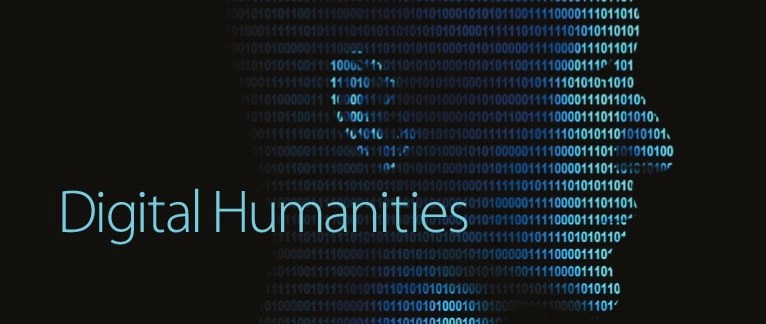

# Methodology in Digital Humanities: The Good And The Ugly  

team: Kiana Eunice Florendo, Daqin (Mike) Lin, and Anna Remler

## Abstract:
Digital Humanities offers great opportunity for interdisciplinary collaboration and strengthens studies for both the Humanities side as well as the computational side. Because of the nature of interdisciplinary research, the complexity of studying and learning from looking at Big Data and doing powerful computational analysis on Humanities subjects often skyrockets. Such complexity implies that working with both qualitative and quantitative data in big scale requires strong knowledge of both fields as well as a well-conceived Methodology, which is oftentimes lacked. In this project, we will examine the pros and cons of such Methodology or the lack thereof, by looking at three different readings: Clement, Owens, and Grimmer. This will help us understand how to approach this subject and how to improve research that heavily relies on data.

collaboration: Kiana initiated the project and decided on the topic, also picked readings that will be used by this project; Anna provides an overview of the topic as well as giving insights from the readings from the Humanities standpoint; Mike analyzed texts (mainly Owens and Grimmer) and provided conclusions. 
